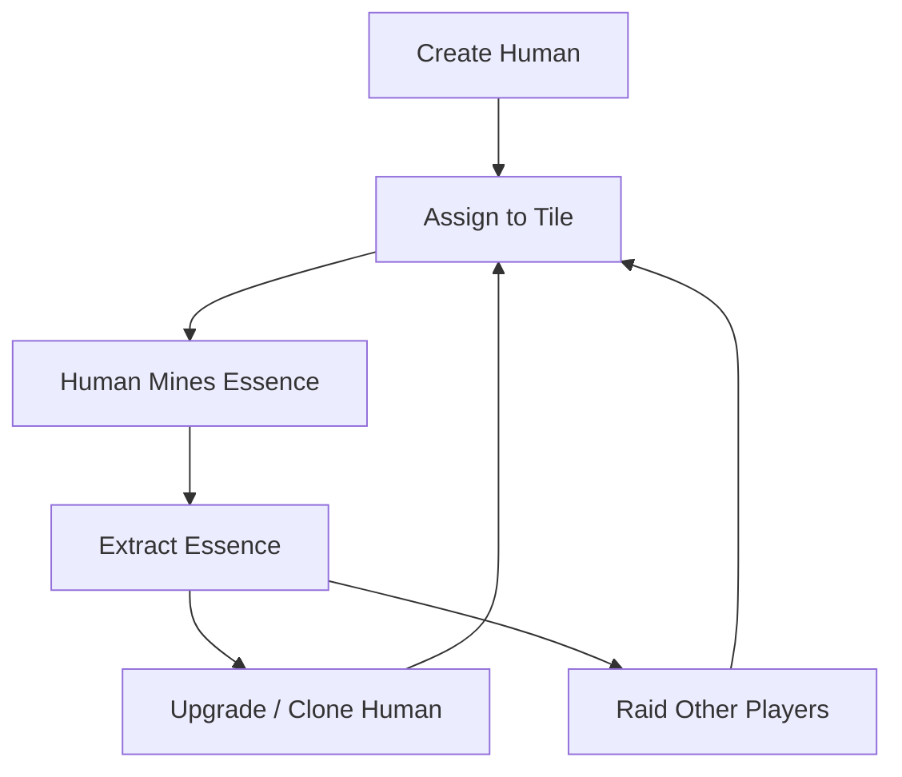

# 📘 HUMAN FARM — Game Design & Developer Reference Docs

---

## 🧠 Game Concept Overview

**HUMAN FARM** is a dystopian isometric strategy game where players manage, mutate, and exploit genetically engineered humans to mine a powerful bio-resource: **Essence**. Players must expand operations, optimize production, defend their sector, and raid others for stolen resources and rare humans.

The game combines **idle resource generation**, **tile-based building**, **real-time animation**, **PvP raiding**, and a deep **morality system** to provide emotionally impactful gameplay.

---

## 🎮 Gameplay Loop



---

## 🌌 World & Layout

* The world consists of a **giant isometric tile map**, divided into player-owned sectors.
* Each player owns a **10x10 isometric grid**, where they can build and place units.
* Tiles can host different **structures** or **humans**.
* A **global map** allows scanning or raiding other players' zones.

---

## 🔁 Player Actions

| Action            | Description                                                 |
| ----------------- | ----------------------------------------------------------- |
| `Create Human`    | Generates a new human unit with randomized traits           |
| `Assign`          | Moves a human to a tile: Farm, Lab, Guard, Idle             |
| `Extract Essence` | Collects produced essence from tile                         |
| `Upgrade`         | Enhances a human’s stats                                    |
| `Raid`            | Launches an attack on another player’s sector               |
| `Defend`          | Builds guard towers or assigns guards                       |
| `Research`        | Unlocks new tech (auto-collect, virus, stealth raids, etc.) |

---

## 🧬 Humans

Each human is a struct or NFT with the following properties:

| Property   | Description                     |
| ---------- | ------------------------------- |
| ID         | Unique identifier               |
| Essence/hr | Production speed                |
| Mutation   | Special trait modifier          |
| Morality   | High = loyal / Low = rebellious |
| Fatigue    | If too high = collapse or death |
| Age        | Affects lifespan                |
| Loyalty    | Affects capture/escape chance   |

Humans work automatically while assigned. Fatigue and Morality must be managed, or humans may **die**, **revolt**, or **flee**.

---

## 🧱 Buildings & Tile Types

| Tile Type           | Effect                             |
| ------------------- | ---------------------------------- |
| `Farm`              | Base Essence production tile       |
| `Lab`               | Allows upgrades, cloning, mutation |
| `Guard Post`        | Defends zone from raiders          |
| `Storage Unit`      | Holds uncollected essence          |
| `Essence Extractor` | Automates collection               |
| `Barracks`          | Hosts guards and raiders           |

Each tile is rendered in isometric view and animated.

---

## ⚔️ Raiding System

* Players can scan nearby player zones on the minimap.
* If another player has uncollected essence or low defense, they become a **viable raid target**.
* Raiding party success depends on:

  * Number of defenders
  * Guard buildings
  * Raider strength and stealth
* Rewards:

  * Stolen essence
  * Captured low-loyalty humans
* Optional: virus attacks, sabotage, or rebel incitement

---

## 🧪 Morality System (Core Mechanic)

Every decision impacts the **morality** and **loyalty** of humans:

| Action                    | Morality Impact |
| ------------------------- | --------------- |
| Overworking               | −15             |
| Cloning without consent   | −25             |
| Providing rest or bonuses | +10             |
| Freeing a human           | +30             |

Low morality = risk of rebellion, suicide, escape, or inciting other workers.

---

## 🧠 AI & Rebellion Mode

* If total zone morality drops below 30%, a **Rebellion Event** triggers:

  * Humans attack buildings
  * Essence production halts
  * Rebels gain control over part of the grid
* Players can:

  * Kill rebels
  * Reprogram via lab
  * Negotiate (if lab tech is unlocked)

---

## 🎨 Visuals (Canvas & HUD)

* Entire gameplay rendered in **isometric canvas** (`@pixi/react`).
* Visual elements:

  * Humans walk from tile to tile
  * Buildings animate while active
  * Particle effects on extraction, rebellion
* HUD (bottom panel):

  * Essence count
  * Buttons: Mint, Assign, Raid, Upgrade
  * Notifications (low morale, raider warning)
* Minimap: shows player’s zone and nearby raidable sectors

---

## 📈 Progression & Expansion

| System              | Purpose                                 |
| ------------------- | --------------------------------------- |
| Daily/Weekly Quests | Keeps users engaged                     |
| Missions Tree       | Unlocks new buildings, automation, tech |
| Ranking System      | Competitive leaderboard                 |
| Cosmetics/NFTs      | Skins, unique humans, farm appearances  |
| PvP Seasons         | Players earn rewards based on rank      |

---

## 🔧 Developer Stack Recommendation

| Layer          | Tool                                                |
| -------------- | --------------------------------------------------- |
| Frontend       | React + @pixi/react (canvas)                        |
| Engine         | Rust + WebAssembly (logic)                          |
| Backend        | (optional) Actix or Axum in Rust                    |
| Smart Contract | Anchor (Solana, optional)                           |
| DB             | Postgres (Essence history, user state)              |
| Assets         | Pixel art via Aseprite or AI-generated placeholders |

---

## 🧪 Testing & Simulation

* All core mechanics can be tested in a **Rust CLI simulation** first:

  * Essence generation per tick
  * Fatigue decay
  * Rebellion triggers
  * Raiding win/loss outcomes
* Later port logic into frontend or smart contract.

---

## 🧨 Viral Hooks

* **Rebellion clips** → “My entire farm rebelled after 3 days…”
* **NFT Human Showcases** → Rare humans with tragic stories
* **Black Market Events** → “1-hour window to buy escaped humans”
* **Auto-generated videos** → Replays of epic raids
* **Social Voting** → Players vote to free/kill rare humans

---

## ✅ Summary

**HUMAN FARM** is a brutal, engaging simulation of exploitation, rebellion, and expansion. It mixes **resource strategy**, **morality**, and **PvP mechanics**, all wrapped in an **isometric, retro-futuristic world** that players will find nostalgic, addictive, and morally provocative.

---

## Run Frontend


```
# 1. Install wasm-pack
cargo install wasm-pack

# 2. Build the frontend to WebAssembly
cd frontend
wasm-pack build --target web --out-dir pkg --out-name human_farm_frontend

# 3. Serve the files locally (any static HTTP server)
# Option A: Python
python3 -m http.server 8080

# Option B: npm http-server
npm install -g http-server
http-server -c-1 -p 8080 .

# 4. Open your browser at:
#    http://localhost:8080

```

